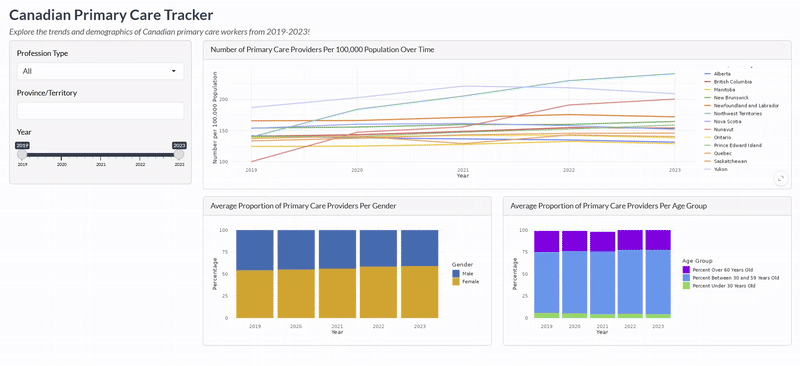
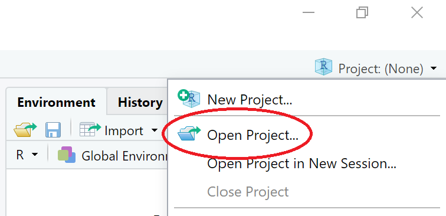
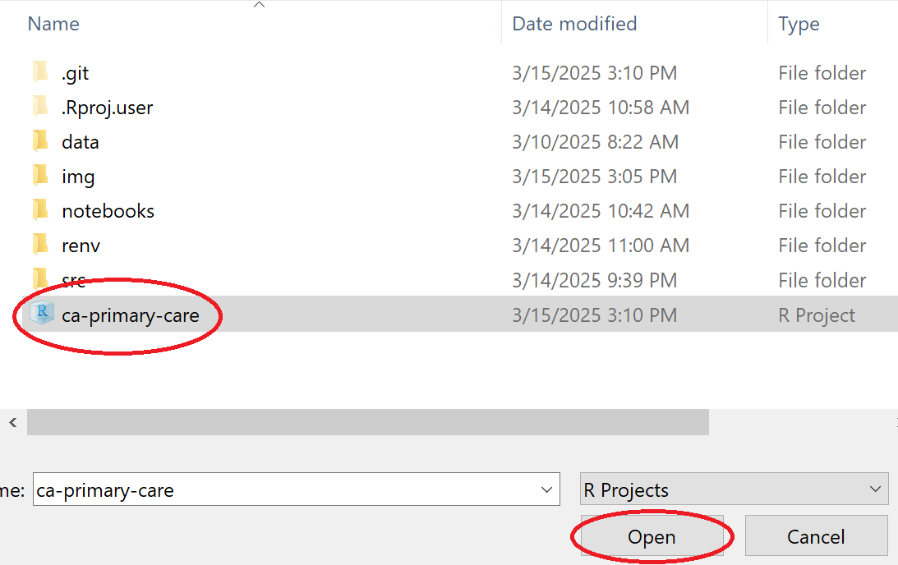
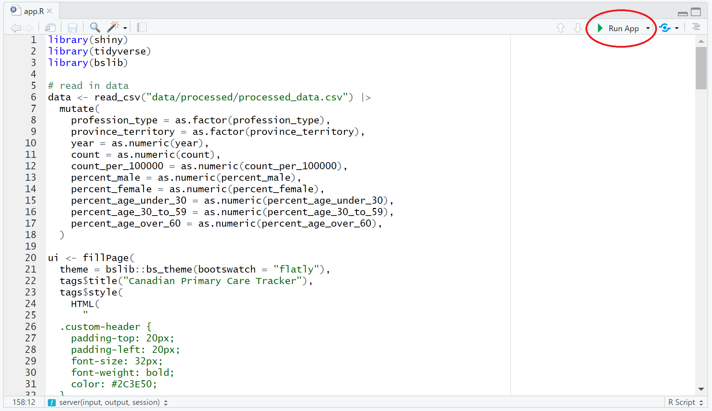

# Canadian Primary Care Tracker
Author/Developer: Stephanie Ta

Explore the trends and demographics of Canadian primary care workers from 2019-2023!
Visit the Shiny R dashboard [here](https://stephanie-ta.shinyapps.io/ca-primary-care/).

## Motivation

According to a report by the Canadian Institute for Health Information, approximately 17% of Canadians do not have a regular healthcare provider, a issue is worsening over time (2024).
This dashboard offers valuable insights into the trends and demographics of Canadian primary care workers, including family doctors and nurse practitioners. It provides detailed information on the number of primary care providers over time per province or territory, the proportion of each gender among primary care providers over time, and the distribution of providers across age groups. Additionally, the dashboard includes filters for profession type (family doctor vs. nurse practitioner), province or territory, and year.
This tool is particularly useful for healthcare administrators and planners, enabling them to monitor workforce trends, identify gaps in primary care coverage, assess the distribution of primary care providers across regions, and analyze workforce demographics. By leveraging this dashboard, healthcare administrators and planners can make informed decisions about resource allocation, recruitment, retention, and succession planning to address current and future primary care needs.

## App Description

- **Explore trends**: view the number of primary care workers per 100,000 of the population over time for each province and territory.
- **Analyze gender proportions**: discover trends in the gender distribution of primary care providers over time.
- **Understand age demographics**: explore the distribution of providers across different age groups.
- **Fitler for more specific insights**: use interactive filters for profession type (family doctor vs. nurse practitioner), province/territory, and year.

The data for this dashboard was sourced from the Canadian Institute for Health Information's (CIHI) "Health Workforce in Canada, 2019 to 2023: Overview" data tables.

## Local Usage
This project uses a `renv` virtual environment to manage packages and dependencies!
Please have `renv` installed (`install.packages("renv")`) if you wish to run the app locally.

1. Clone this GitHub repository to your local machine:
   - Click the green `<> Code` button and copy the url.
   - Navigate to where you'd like the cloned repository to reside in your local machine via the terminal.
   - Run the command `git clone <url>` in the terminal.

2. Open RStudio and navigate to the project directory in RStudio. Open the project by clicking the `Project` dropdown, selecting `Open Project...`, navigating to the project directory in the pop up, and selecting the `ca-primary-care` R Project file.

   > 
   > 

3. Create a `renv` virtual environment by running `renv::restore()` in the R console of RStudio. This will install the packages listed in the `renv.lock` file in a `renv` virtual environment.

4. Navigate to and open `src/app.py` in RStudio. Run the app locally by clicking the `▶ Run App` button.

   > 

## References
Canadian Institute for Health Information. (2024, December 5). Access to primary care: Many Canadians face challenges. Retrieved March 12, 2025, from https://www.cihi.ca/en/primary-and-virtual-care-access-emergency-department-visits-for-primary-care-conditions/access-to-primary-care-many-canadians-face-challenges

Canadian Institute for Health Information. (2025). Health Workforce in Canada, 2019 to 2023: Overview — Data Tables.